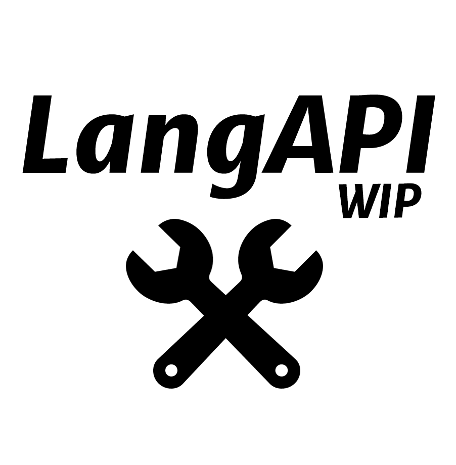

<!--
*** Thanks for checking out the Best-README-Template. If you have a suggestion
*** that would make this better, please fork the repo and create a pull request
*** or simply open an issue with the tag "enhancement".
*** Don't forget to give the project a star!
*** Thanks again! Now go create something AMAZING! :D
-->

<!-- PROJECT SHIELDS -->
<!--
*** I'm using markdown "reference style" links for readability.
*** Reference links are enclosed in brackets [ ] instead of parentheses ( ).
*** See the bottom of this document for the declaration of the reference variables
*** for contributors-url, forks-url, etc. This is an optional, concise syntax you may use.
*** https://www.markdownguide.org/basic-syntax/#reference-style-links
-->

<!-- PROJECT LOGO -->
 

  

<h3 align="center">langApi</h3>

  

    project_description
     
  

<!-- ABOUT THE PROJECT -->
## About The Project

Mod for TBoI Repentance. It helps gets names/description after developers introduces new language files with no modding api.
It uses python to parse TBoi sta lang file to readable lua tables. Api helps gets string value from tables.
It's created to help with developing other mod <i>coopHUD</i> and will be documented after first release of <i>coopHUD</i> mod.

(<a href="#top">back to top</a>)

### Installation

1. Get it from Steam Workshop - <b>link available when I'll release coopHUD mod </b>[https://example.com](https://example.com)

(<a href="#top">back to top</a>)

<!-- USAGE EXAMPLES -->
## Usage

* WIP

(<a href="#top">back to top</a>)

<!-- CONTACT -->
## Contact

srokks -  - srokks@gmail.com

Project Link: [https://github.com/srokks/langApi](https://github.com/srokks/langApi)

(<a href="#top">back to top</a>)

